# **Git and Gitlab assignment**
### **Main Task: GitHub & GitLab Collaboration & Workflow Setup**

You are part of a DevOps team working on two different platforms – GitHub and GitLab. Your team wants to ensure smooth development, proper access control,and repository mirroring between the two platforms.

---
## **Part 2 : GitLab Tasks**
### Subtask 4: GitLab Repository Setup

#### 1. Create a private repository on GitLab.
 - Created On Private Repo On GitLab
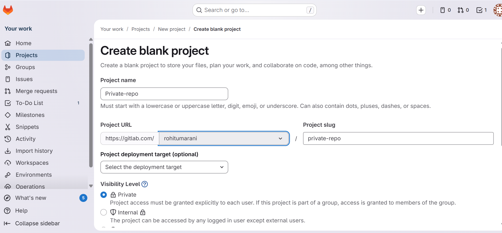

#### 2. Clone it on your local machine using SSH (not HTTPS).
- Copy The URL SSH URL
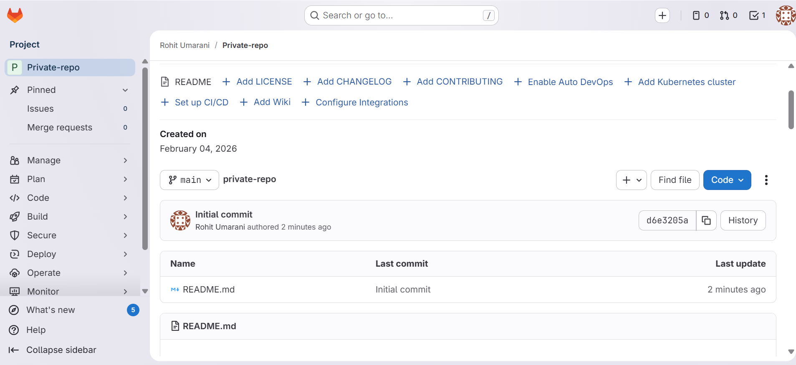

- Create One Folder Into Local Machine
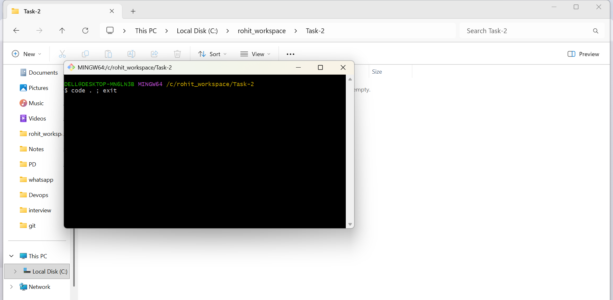


- Use Commond For Clone Private Repo To Local Machine
   ```bash 
   git clone git@gitlab.com:rohitumarani/private-repo.git
   ```
  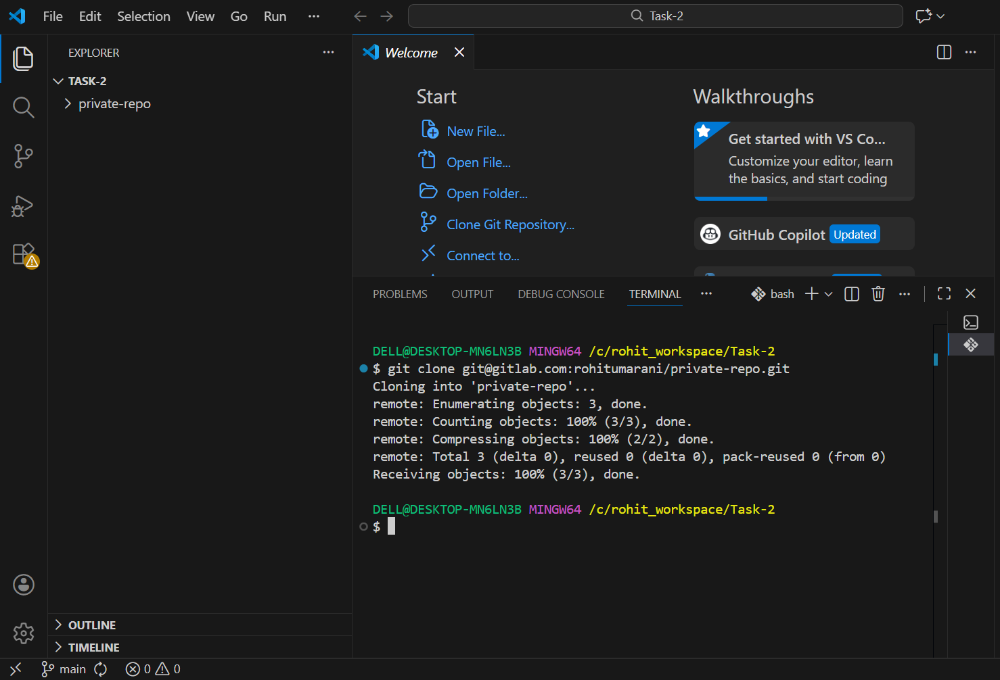

 - Already Created SSH Key 
 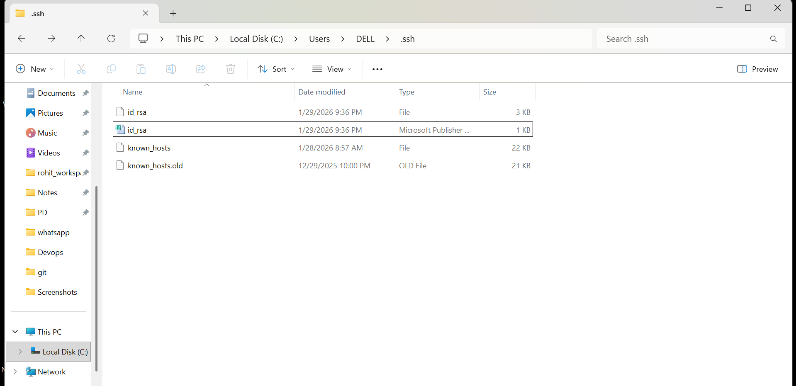
 How to check the Path:
   ```bash 
   C:\Users\DELL\.ssh
   ```
- SSH Key On GitLab
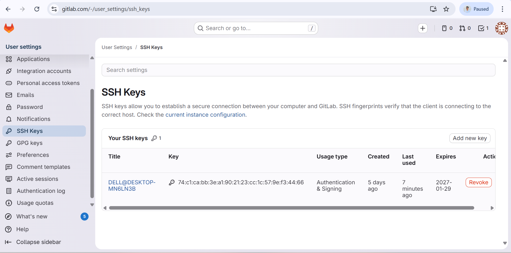

#### 3. Create a simple project structure (e.g., src/app.py , docs/guide.md).

- Created Src Folder inside that app.py file
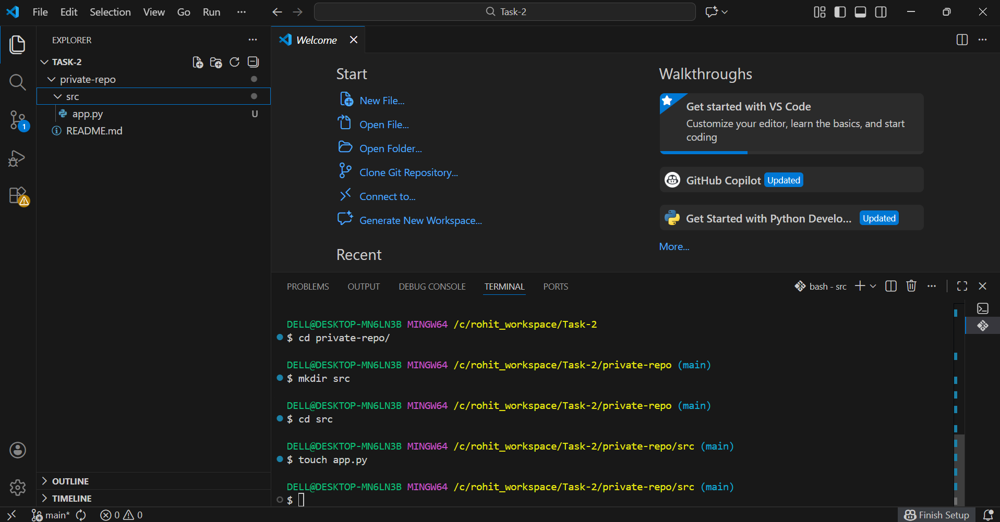
- Created docs Folder inside that guide.md file
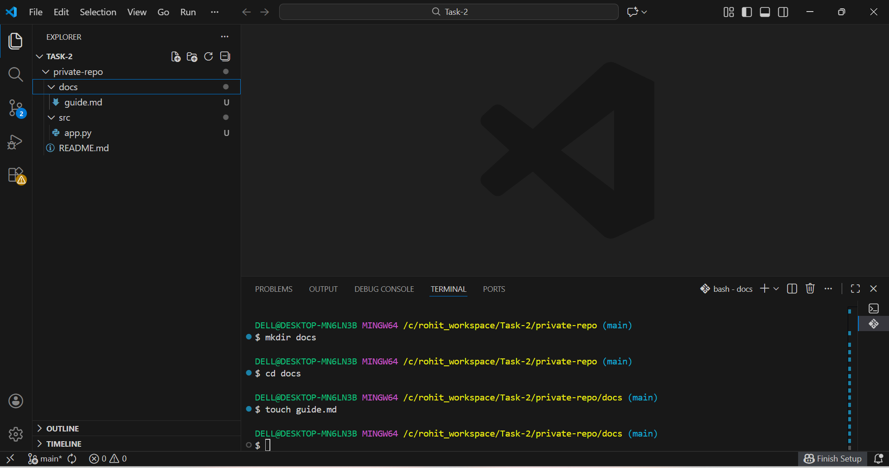

---

### Subtask 5: Repository Mirroring
---
#### Create a mirror setup:
#### 1. Set the GitHub private repo as the mirror of your GitLab repo.

- Created One New Repo On Github For Mirroring
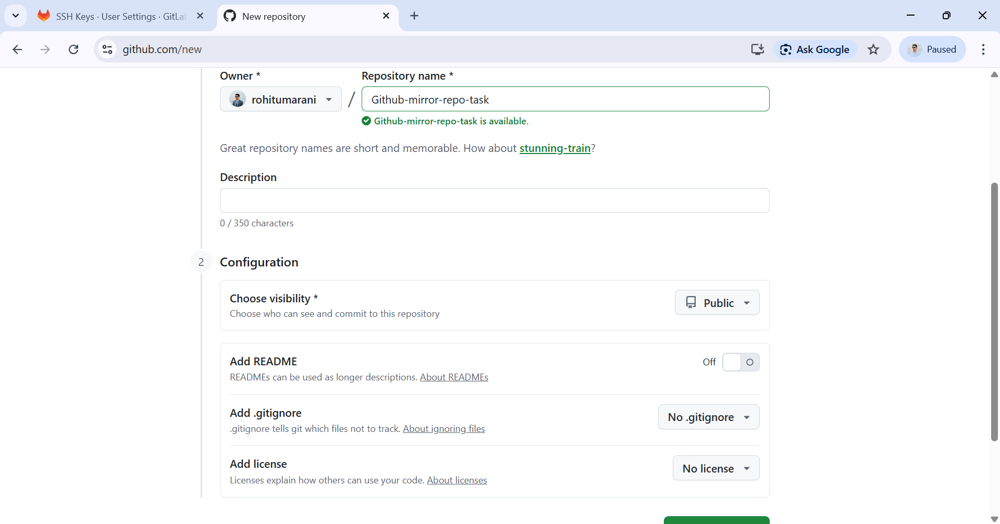

- Add This Github Repository to the GitLab Repository
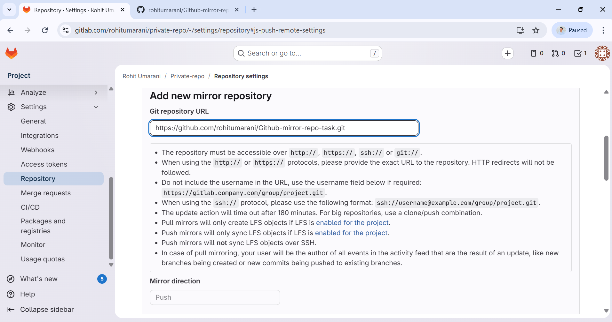

- Create Personal Acess Token. It Required For Password Authetication 
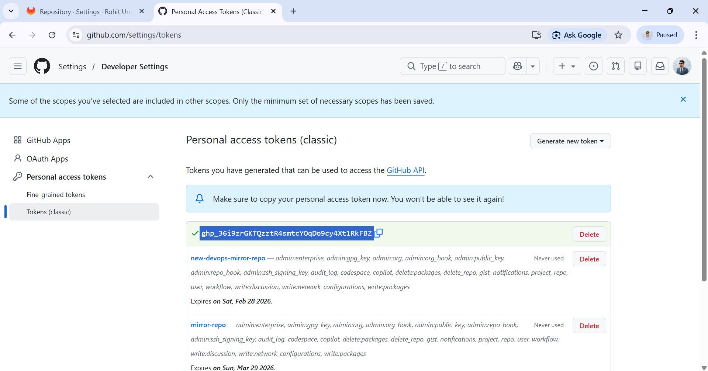

- After That Paste That Tokenn And Setup Up GitLab and GitHub 
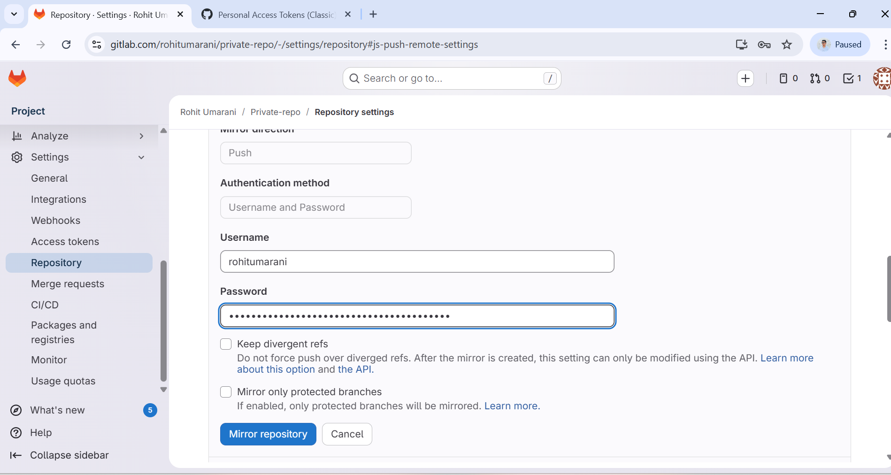

#### 2. Push some changes to GitLab and verify if the changes reflect in GitHub automatically.

- Push the Changes 

 Use Commond For Push 
   ```bash 
   git push -u origin main
   ```


 
- Check On GitLab Changes 
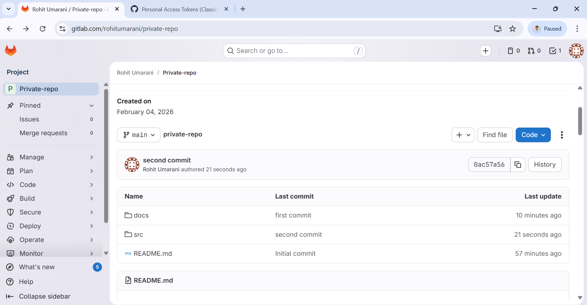

- Check On Github Changes
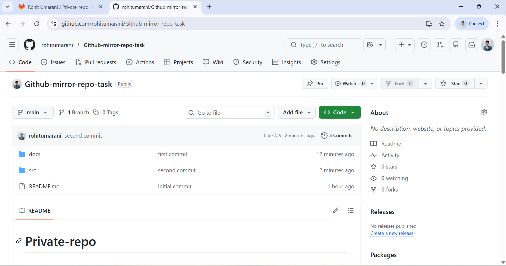

---

### Subtask 6: Access Control

---
#### Invite your friend to the GitLab private repository:

- Invite Member to the Repository
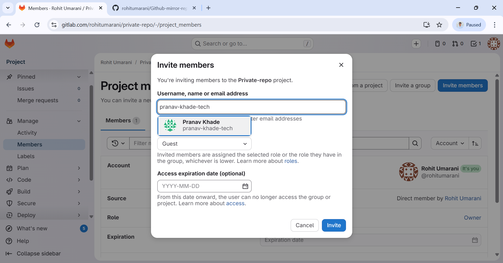
- Assign them the Guest role initially, observe the access.
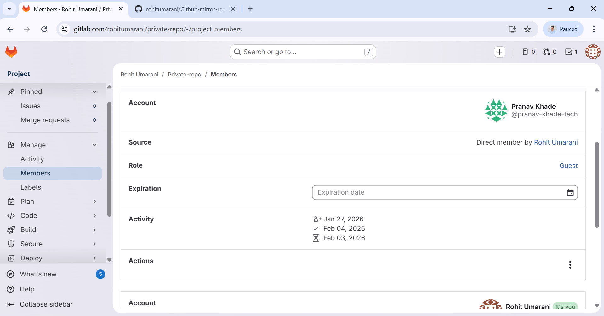

- Then change their role to Developer, and let them push one file.
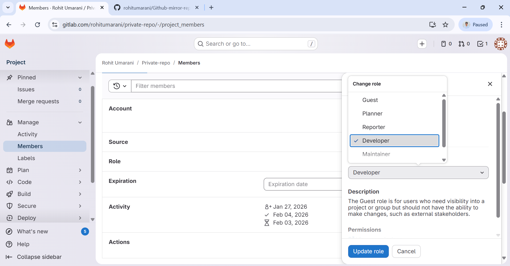
Role is Change To the Devolper
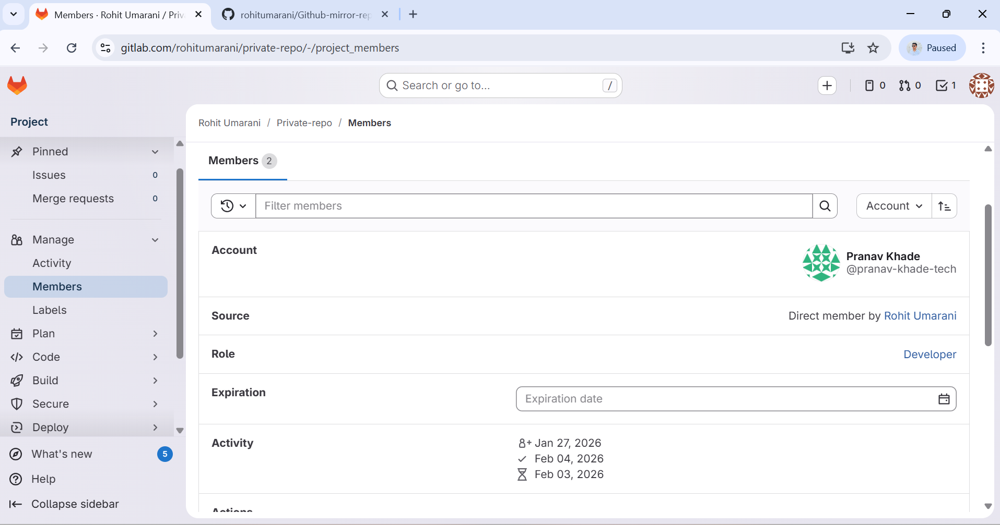

---

